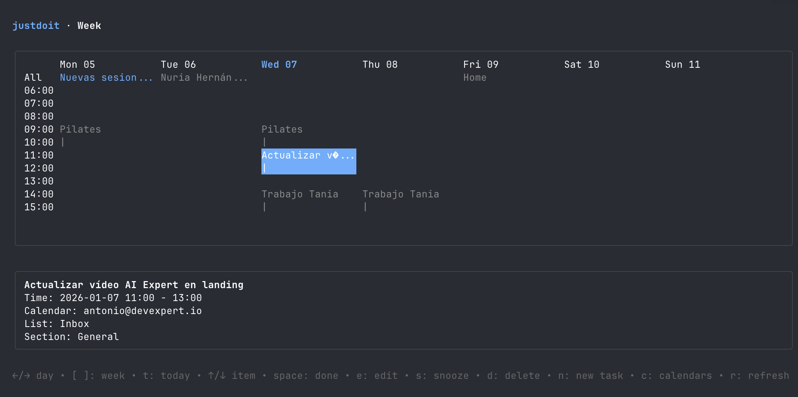

# justdoit (CLI)




Time‑blocking CLI for Google Tasks + Google Calendar. The CLI creates `config.json` automatically and provides an interactive setup.

## Requirements
- Go 1.22+
- A Google Cloud project with **Google Tasks API** and **Google Calendar API** enabled
- OAuth client credentials (Desktop App)

## Setup

1) **Google Cloud Console**
- Create a project.
- Enable **Google Tasks API** and **Google Calendar API**.
- In “APIs & Services” → “Credentials”, create an **OAuth client ID** of type **Desktop app**.
- Download the JSON and save it as `~/.config/justdoit/credentials.json`.
- On macOS you can also use `~/Library/Application Support/justdoit/credentials.json`.

2) **Interactive setup (recommended)**
```
./justdoit setup
```
This uses arrow‑key selection, hides IDs, and will:
- Pick a calendar
- Choose the Inbox list (required)
- Optionally map additional lists
- Optionally create new lists

3) **First OAuth login**
- The CLI opens a local callback and captures the code automatically.
- If your terminal supports links you’ll get a clickable URL.
- Token is stored in `~/.config/justdoit/token.json` (or macOS Application Support path).

## Usage

## TUI (default)

Running `justdoit` with no args launches an interactive terminal UI (Next, Week, Lists, Search).

```bash
justdoit
```

Key bindings:
- `Ctrl+N`: quick capture
- `Ctrl+F`: search

Search view filters:
- `Ctrl+L`: cycle list filter
- `Ctrl+A`: include completed

## CLI examples
```bash
# build
go build -o justdoit ./cmd/justdoit

# install (macOS default path)
go build -o /opt/homebrew/bin/justdoit ./cmd/justdoit

# add a task
justdoit add "Refactor API"

# add a task with a calendar block
justdoit add "Refactor API" --time "15:00-17:00"

# add a task into a section (sublist)
# sections must exist (create with `justdoit section create`)
# if omitted, it goes to "General"
justdoit add "Write ADR" --section "This week"

# add a task for tomorrow with a block
justdoit add "Review PR" --date "tomorrow" --time "today 3pm-4pm"

# 1 hour from now
justdoit add "Code review" --time "1h"

# mark done and add ✅ prefix to calendar event
justdoit done <TASK_ID>

# update a task (title/date/time/section)
justdoit update <TASK_ID> "New title"
justdoit update <TASK_ID> --date "tomorrow" --time "16:00-17:00"
justdoit update <TASK_ID> --section "This week"

# move a task to another list/section
justdoit move <TASK_ID> --list "Inbox" --to "Work" --section "This week"

# create sections
justdoit section create "This week" "This month" --list "Work"

# rename a section
justdoit section rename "This week" "This month" --list "Work"

# list sections
justdoit section list --list "Work"

# delete a task (and linked event)
justdoit delete <TASK_ID>

# list tasks grouped by section
justdoit list --list "Work"
# include completed/hidden
justdoit list --list "Work" --all
# filter by section
justdoit list --list "Work" --section "This week"

# search tasks
justdoit search "invoice"
justdoit search "invoice" --list "Work" --all

# schedule view + free slots
justdoit view
# view another day or range
justdoit view --date "tomorrow"
justdoit view --date "2026-01-01..2026-01-07"

# list calendars
justdoit config calendars

# set calendar
justdoit config set-calendar <CALENDAR_ID>

# list Google Tasks lists (remote)
justdoit config lists remote

# create list in Google Tasks and map it locally
justdoit config lists create "Personal"

# add a local mapping manually
justdoit config lists add "Work" <LIST_ID>

# interactive setup
justdoit setup
```

## Development

```bash
# tests
make test

# lint (golangci-lint required)
make lint

# tidy go.mod/go.sum
make tidy
```

## Recurrence

Use `--every` with simple values:
- `daily`
- `weekly`
- `monthly`
- `yearly`

Example:
```bash
./justdoit add "Weekly planning" --every "weekly" --time "09:00-10:00"
```

## Notes
- If you use `--time`, the CLI creates both a Google Task and a Calendar event.
- The event stores the task ID in the description (`justdoit_task_id=...`).
- The task stores the event ID in notes (`justdoit_event_id=...`).
- Sections are implemented as parent tasks with `justdoit_section=1` in notes.
